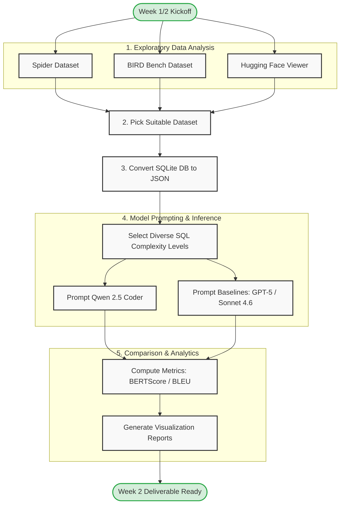

## GPT Execution Accuracy : 12/12
## QWEN 2.5 coder Execution Accuracy : 8/12

## BLEU Scores
     Model  codebleu  ngram_match_score  weighted_ngram_match_score  \
0  ChatGPT    0.5812             0.2504                      0.2659   
1  Qwen2.5    0.4134             0.0307                      0.0399   

   syntax_match_score  dataflow_match_score  
0              0.8085                     0  
1              0.5831                     0  

## BERT SCORE
Average Scores
         precision  recall      f1
model                             
ChatGPT     0.8401  0.7337  0.7853
Qwen2.5     0.5868  0.3473  0.4630

## At a Glance
| Metric             |    ChatGPT |       Qwen |
| ------------------ | ---------: | ---------: |
| Execution Accuracy |      91.7% |      58.3% |
| CodeBLEU           | **0.5812** | **0.4134** |
| BERTScore F1       | **0.7853** | **0.4630** |
