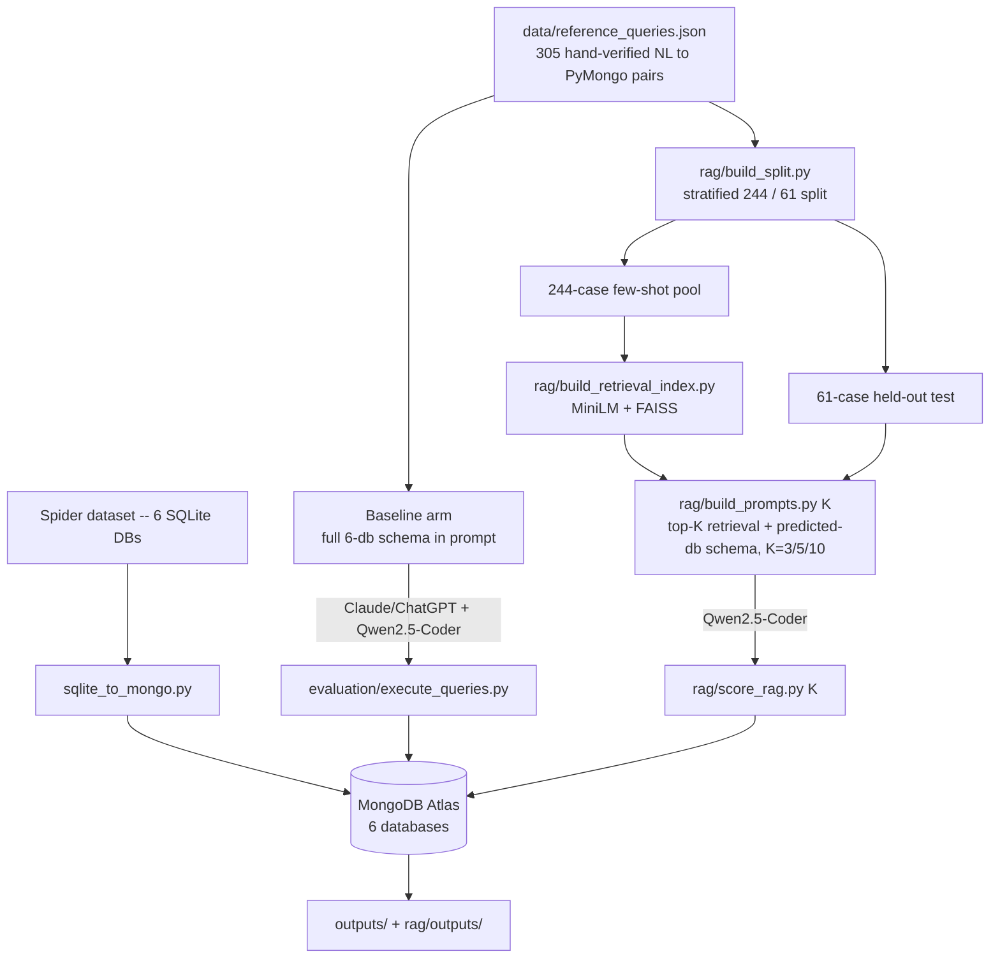

# Capstone Project: Natural Language → MongoDB Query Generation

This repository benchmarks natural-language-to-MongoDB query generation across two axes:
model choice (Claude/ChatGPT vs. Qwen2.5-Coder-1.5B-Instruct) and prompting strategy (a
full-schema zero-shot baseline vs. a retrieval-augmented arm, swept across K=3/5/10). All
evaluation runs against six Spider-derived databases loaded into a real MongoDB Atlas
cluster, scored by actually executing every generated query and comparing results to gold
output.

## Project workflow

## Databases

Six Spider-derived databases, loaded as MongoDB collections (`database/mongodb/<db>/`):

| Database | Collections |
| --- | --- |
| `concert_singer` | concert, singer, singer_in_concert, stadium |
| `pets_1` | Has_Pet, Pets, Student |
| `network_1` | Friend, Highschooler, Likes |
| `car_1` | car_makers, car_names, cars_data, continents, countries, model_list.json |
| `world_1` | city, country, countrylanguage |
| `dog_kennels` | Breeds, Charges, Dogs, Owners, Professionals, Sizes, Treatment_Types, Treatments |

`data/reference_queries.json` holds **305** hand-verified natural-language question →
PyMongo query pairs across these six databases, each tagged with a complexity level
(easy/medium/hard) and its gold collection(s). This grew from an original 121-case set via
the Spider dataset-expansion pipeline described below.

## Results

### Baseline arm (full 305-case set, complete 6-database schema in every prompt)

| Model | Execution Accuracy | Ran OK |
| --- | ---: | ---: |
| Claude/ChatGPT | 55.4% (169/305) | 93.8% (286/305) |
| Qwen2.5-Coder-1.5B | 4.3% (13/305) | 88.5% (270/305) |

Claude/ChatGPT, a much larger model, comfortably outperforms the 1.5B Qwen model zero-shot -- the
gap is the motivation for the RAG arm below: can retrieval close some of that gap for a
small, locally-runnable model without switching models entirely?

### RAG vs. baseline (matched 61-case held-out slice, same gold, same scoring code, K-swept)

Qwen2.5-Coder-1.5B-Instruct only, comparing the full-schema baseline prompt against a
retrieval-augmented prompt (top-K similar few-shot examples + one retrieved database's
schema), both scored on the identical 61 held-out test ids at every K so the comparison
isn't confounded by different test sets:

| K | Qwen-Baseline (test-slice) | Qwen-RAG | Database retrieval diagnostic |
| ---: | ---: | ---: | ---: |
| 3 | 4.9% (3/61) | 21.3% (13/61) | 95.1% (58/61) |
| 5 | 4.9% (3/61) | 23.0% (14/61) | 96.7% (59/61) |
| 10 | 4.9% (3/61) | 24.6% (15/61) | 96.7% (59/61) |

RAG accuracy rises monotonically with K, consistent with a wider retrieval vote being less
exposed to a couple of noisy nearest hits -- roughly a 3-5x lift over baseline across the
whole K range. At `n=61` the worst-case standard error on any of these proportions is
still ~±6 points, so treat differences between adjacent K values as directional, not
precise; the baseline-vs-RAG gap itself is large enough to be a clear signal regardless.

## RAG design

- **Retrieval**: dense semantic search only (`all-MiniLM-L6-v2` embeddings, FAISS
  `IndexFlatIP`) against a 244-example
  few-shot pool. Verified failure analysis shows retrieval
  itself accounts for only ~1/61 misses (~2%).
- **K is a parameter** (`python rag/build_prompts.py [K]`, default 10), swept at
  3/5/10 on the identical split so K's effect isn't confounded with dataset-size changes.
- **Database prediction**: majority vote across the top-K retrieved neighbors' source
  database (ties broken by the nearest neighbor), not a separate schema-retrieval index --
  reuses the one embedding call already being made for few-shot retrieval.
- **Schema scope**: once a database is predicted, its *entire* schema (every collection)
  is included in the prompt, not a filtered subset -- avoids leaving out a collection a
  `$lookup` join needs even when the database prediction itself is correct.
- **Split**: 305 reference queries stratified by database into a 244-example few-shot pool
  and a 61-example held-out test set (`rag/build_split.py`, fixed random seed), asserted to
  have zero id overlap.
