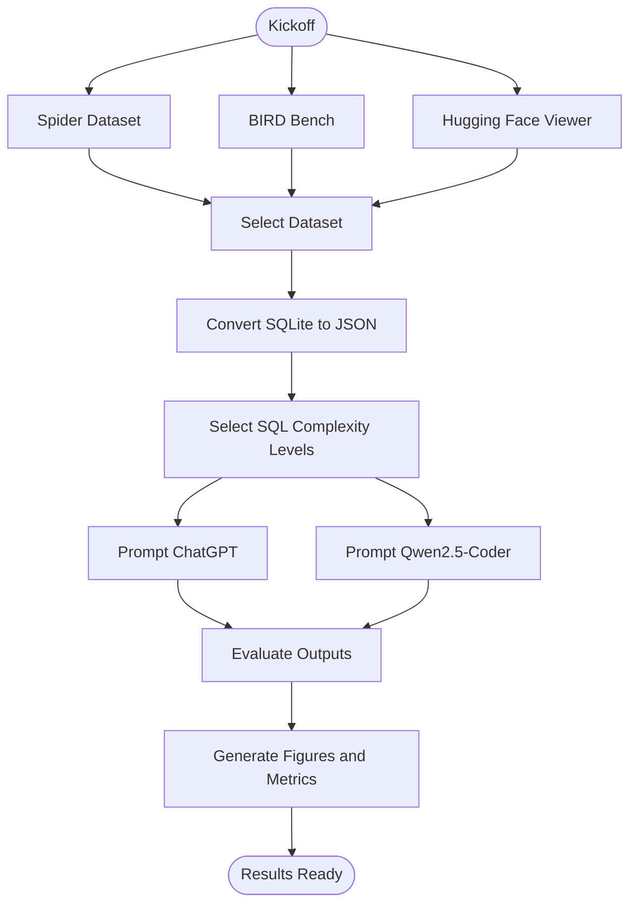
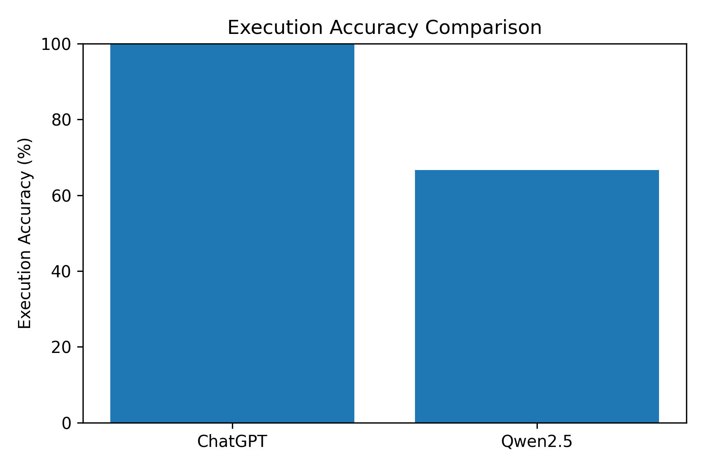
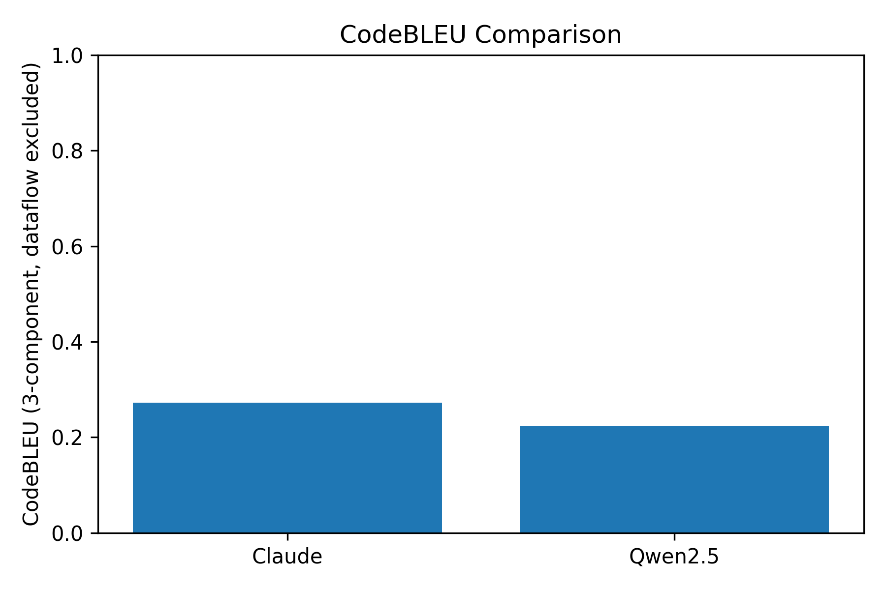
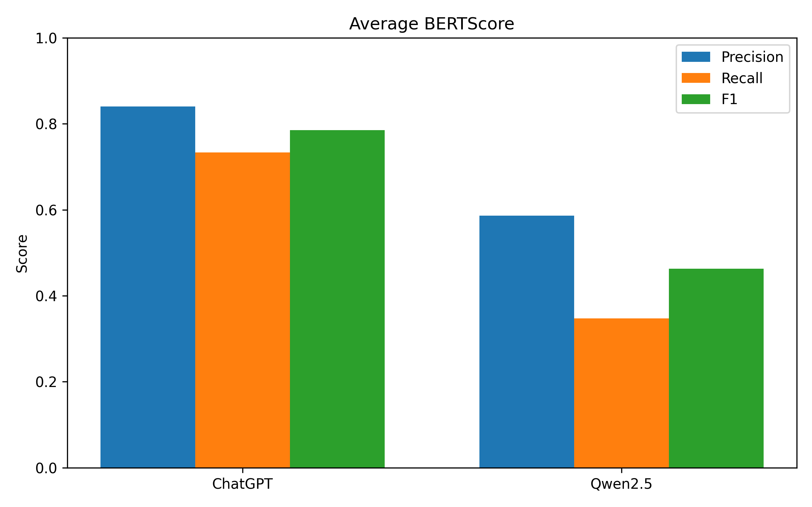
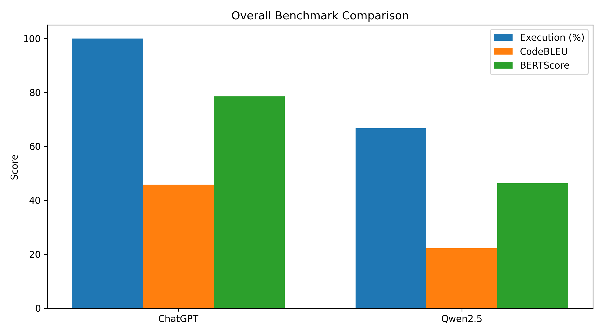

# Capstone Project Report

This repository documents a compact evaluation workflow for comparing SQL-generation performance across two models: ChatGPT and Qwen2.5-Coder. The project combines dataset exploration, prompt-based inference, and quantitative evaluation using CodeBLEU and BERTScore.

## Project Workflow

## Key Results at a Glance

| Metric | ChatGPT | Qwen2.5-Coder |
| --- | ---: | ---: |
| Execution Accuracy | 12/12 | 8/12 |
| CodeBLEU | 0.5812 | 0.4134 |
| BERTScore F1 | 0.7853 | 0.4631 |

## Evaluation Visuals

### Execution Accuracy

### CodeBLEU Comparison

### BERTScore Comparison

### Overall Comparison

## Metric Tables

### CodeBLEU Scores

| Model | CodeBLEU | N-gram Match | Weighted N-gram | Syntax Match | Dataflow Match |
| --- | ---: | ---: | ---: | ---: | ---: |
| ChatGPT | 0.5812 | 0.2504 | 0.2659 | 0.8085 | 0.0000 |
| Qwen2.5 | 0.4134 | 0.0307 | 0.0399 | 0.5831 | 0.0000 |

### BERTScore Summary

| Model | Precision | Recall | F1 |
| --- | ---: | ---: | ---: |
| ChatGPT | 0.8401 | 0.7337 | 0.7853 |
| Qwen2.5 | 0.5868 | 0.3473 | 0.4631 |

## Interpretation

- ChatGPT consistently outperformed Qwen2.5-Coder across the evaluated SQL generation tasks.
- The strongest gap appears in the semantic similarity and overall quality metrics, indicating better structural and contextual understanding for ChatGPT.
- The generated plots in the outputs folder provide a clear visual summary of the performance differences.

## Repository Notes

- Raw evaluation outputs are stored in the outputs folder.
- Figures are generated under the outputs/figures directory.
- The baseline prompt used for comparison is available in [baseline_model_prompt.md](baseline_model_prompt.md).
