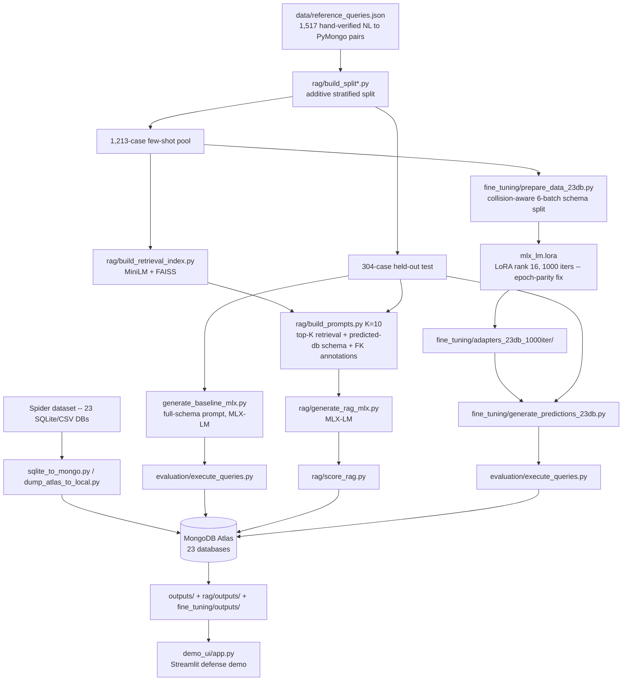

# Capstone Project: Natural Language → MongoDB Query Generation

This repository benchmarks natural-language-to-MongoDB query generation across two axes:
model choice (Claude/ChatGPT vs. Qwen2.5-Coder-1.5B-Instruct) and adaptation strategy for
the small model (a full-schema zero-shot baseline, a retrieval-augmented arm, and LoRA
fine-tuning). The dataset has grown across three expansion rounds from an original 6
Spider-derived databases / 305 cases to **23 databases / 1,517 hand-verified NL→PyMongo
pairs**, all loaded into a real MongoDB Atlas cluster and scored by actually executing
every generated query and comparing results to gold output — never by string match.

**All three Qwen arms (baseline, RAG, fine-tuned) now generate on the same serving stack**:
MLX-LM, run locally on Apple Silicon. This replaced an earlier Colab/HF-`transformers`
(fp16 GPU) path for baseline and RAG.

## Project workflow



## Databases

23 Spider-derived databases, loaded as MongoDB collections (`database/mongodb/<db>/`).
The original 6 (`concert_singer`, `pets_1`, `network_1`, `car_1`, `world_1`, `dog_kennels`)
were expanded with 7 more in round 2 and 10 more in round 3:

| Database | Collections | Database | Collections | Database | Collections |
| --- | ---: | --- | ---: | --- | ---: |
| apartment_rentals | 6 | csu_1 | 6 | pets_1 | 3 |
| baseball_1 | 26 | dog_kennels | 8 | sakila_1 | 12 |
| bike_1 | 4 | flight_2 | 3 | store_1 | 11 |
| car_1 | 6 | flight_4 | 3 | wine_1 | 3 |
| chinook_1 | 11 | formula_1 | 11 | world_1 | 3 |
| college_1 | 7 | hr_1 | 7 | wta_1 | 3 |
| college_2 | 11 | inn_1 | 2 | | |
| college_3 | 8 | network_1 | 3 | | |
| concert_singer | 4 | | | | |

`data/reference_queries.json` holds **1,517** hand-verified natural-language question →
PyMongo query pairs across these 23 databases (305 → 735 → 1,517 across three expansion
rounds), each tagged with a gold collection set and, a complexity level
(easy/medium/hard). Split additively (not reshuffled) into
a **1,213-case few-shot pool** (`rag/data/rag_fewshot_pool.json`) and a **304-case
held-out test set** (`rag/data/rag_test.json`), with zero id or question-text overlap
between them, verified independently of every prior round's split.

## Why the serving stack matters

Earlier rounds generated baseline and RAG via Colab + HF `transformers` in fp16 on a
shared GPU, while fine-tuning ran locally via MLX-LM on Apple Silicon (bf16). That
turned out to be a real confound- fp16 GPU inference
without deterministic-algorithm flags is **not bit-identical across separate Colab
sessions**, even under greedy decoding — verified directly by generating an identical
prompt-content change and its full revert back-to-back in one session and getting
byte-for-byte identical output, which is only possible if a *session boundary*, not the
code, drove an earlier apparent accuracy swing.

Once RAG was re-measured on the same MLX-LM stack as fine-tuning, RAG's accuracy on the
original, unchanged 61-case matched slice rose from 24.6% to **50.8%** — more than
double, on identical questions, identical gold, identical scoring code, with only the
serving stack changed. That reversed this project's earlier reported conclusion
("LoRA fine-tuning beats RAG at every K tested") — RAG is the stronger arm once every
arm sits on the same stack. `generate_baseline_mlx.py`, `rag/generate_rag_mlx.py`, and
`fine_tuning/generate_predictions_23db.py` are the current, unified generation scripts;
the Colab-based baseline/RAG scripts remain in the repo for the historical 305-case
Stage 1 result only (see below).

## Results (current, full 304-case test set, unified MLX-LM stack)

| Arm | Execution Accuracy | Outcome mix: correct / wrong-nonempty / empty / hard-fail |
| --- | ---: | --- |
| Zero-shot baseline | 4.9% (15/304) | 15 / 68 / 172 / 49 |
| RAG (K=10, FK-included, canonical) | 46.7% (142/304) | 141 / 86 / 63 / 14&nbsp;\* |
| LoRA fine-tuned (23-db, 1000-iter epoch-parity retrain) | **33.9% (103/304)** | 103 / 105 / 80 / 16 |

<sub>\* RAG's canonical score (142/304, FK-included) is the aggregate CSV figure; a
later FK-vs-no-FK A/B test run (see below) overwrote the FK variant's case-level
execution-results JSON, so the outcome-mix breakdown above uses the surviving no-FK
case file (141/304 correct) — 1 case off the canonical aggregate, well inside noise,
and documented rather than silently substituted.</sub>

RAG is the clear leader on the current full-scale comparison. Fine-tuning still clears
the zero-shot baseline by a wide margin (~7x) but trails RAG by a real margin even after
its own methodology bug (below) was fixed.


### Accuracy by complexity (304-case test set)

| Complexity | n | Baseline | RAG | Fine-tuned |
| --- | ---: | ---: | ---: | ---: |
| Easy | 75 | 9.3% | 60.0% | 54.7% |
| Medium | 111 | 4.5% | 40.5% | 28.8% |
| Hard | 39 | 0.0% | 28.2% | 17.9% |
| Unknown&nbsp;\* | 79 | 3.8% | 50.6% | 29.1% |

<sub>\* 79 cases, all from the newest expansion round, have no `complexity` value in
`data/reference_queries.json` — a genuine data-quality gap, surfaced as its own bucket
rather than dropped or force-fit into another one.</sub>

### RAG vs. fine-tuned: different cases, not just different rates

Correct-set overlap out of 304: **both** arms correct on 64 cases, **RAG-only** 77,
**fine-tuned-only** 39, **neither** 124 — union 180/304 (59.2%), well above either arm
alone. The two arms fail on substantially different cases, not just at different rates.

### FK schema annotations — A/B tested, null result

Whether including foreign-key annotations in the RAG prompt's schema block helps was
tested as a controlled A/B run on MLX-LM - **FK-included 142/304 (46.7%) vs. no-FK 141/304
(46.4%)**. A 1-case, 0.3-point difference. FK annotations don't measurably help
or hurt on top of what schema + few-shot examples already provide.

## Fine-tuning: the epoch-parity fix

When the fine-tuning arm was retrained to cover all 23 databases (up from the original
6), its LoRA config initially carried over `iters: 200` unchanged from the 6-db run —
a deliberate controlled variable at the time, but it produced a real, undiagnosed
under-training bug: the 6-db adapter's 200 iterations covered ~3.65 epochs of its
219-example training set, while the same 200 iterations over the 23-db run's larger
1,091-example set covered under 0.75 of a single epoch. Restoring the same ~3.65-epoch
*coverage* (not the same raw iteration count) meant raising `iters` to **1,000**
(`fine_tuning/lora_config_23db_1000iter.yaml`; every other hyperparameter — rank, layers,
batch size, learning rate — held identical). Result: **73/304 (24.0%) → 103/304
(33.9%)**, a real, substantial recovery. **This 1,000-iteration adapter and its 33.9%
figure are the current, canonical fine-tuning result** — an earlier 200-iteration
adapter's 24.0% figure, and any chart generated before this retrain, is superseded.

An earlier bug in the same pipeline, fixed separately before this: the 23 databases are
split into fixed batches for training (a **batched schema** design — each training
example sees only its own database's batch schema, up to 4 databases per batch, keeping
prompt length close to the original single-database design's size class rather than a
~6x-longer 23-database monolith). The first version of this batching sorted databases
alphabetically with no awareness of which ones resemble each other, which put the three
near-identical `college_1`/`college_2`/`college_3` databases (same schema, three
different field-naming conventions) in one training batch — the model learned to answer
`college_3` questions using `college_1`'s or `college_2`'s field names. Fixed with a
collision-aware greedy batching algorithm driven by an explicit `COLLISION_GROUPS` list
in `fine_tuning/prepare_data_23db.py` (also covering `chinook_1`/`store_1`,
`flight_2`/`flight_4`, `store_1`/`sakila_1`); `college_3` recovered from 0% correct to
positive double digits once separated from its naming-convention siblings.

Fine-tuning specifics: LoRA rank 16, scale 2.0, 16 layers, dropout 0.0 — 0.68% of the
model's 1.54B parameters trainable (10.55M) — trained via `mlx_lm.lora` on
`fine_tuning/data_23db/` (1,091 train / 122 valid examples, built from the 1,213-case
few-shot pool with two independent leakage checks — id overlap and question-text overlap
against the 304-case test set, both zero). Final train loss 0.030, val loss 0.024, peak
Metal memory ~15.4GB.

## RAG design

- **Retrieval**: dense semantic search only (`all-MiniLM-L6-v2` embeddings, FAISS
  `IndexFlatIP`) against the 1,213-example few-shot pool.
- **K=10** (`python rag/build_prompts.py 10`), the setting used for the canonical
  304-case result; a K=3/5/10 sweep on the earlier, smaller matched-61 slice showed
  accuracy rising monotonically with K.
- **Database prediction**: majority vote across the top-K retrieved neighbors' source
  database — 258/304 (84.9%) database-retrieval accuracy across the current 23 candidate
  databases (down from 96.7% on the original 6-database slice, as expected for a harder
  23-way retrieval problem).
- **Schema scope**: once a database is predicted, its entire schema (every collection)
  is included in the prompt, with FK-relationship annotations included by default
  (A/B tested against omitting them — see above, a null result either way).
- **Serving**: generation runs via `rag/generate_rag_mlx.py` against MLX-LM directly,
  using each case's own retrieved schema/few-shot prompt from `rag/data/rag_prompts.json`.

## Demo UI

`demo_ui/app.py` is a Streamlit app built for live capstone-defense presentation:
Baseline / RAG / Fine-Tuned / Compare-All-3 tabs replay 5 curated, source-verified
example cases (zero model loading, cannot fail or hang) pulled directly from this
project's own execution-result JSON files and re-verified against the current
epoch-parity-fixed (1000-iteration) fine-tuned adapter. A fifth, experimental
Live Inference tab actually loads Qwen2.5-Coder-1.5B via MLX and generates a fresh
answer for any typed question, reusing the repo's own prompt-building and generation
code (`rag/build_prompts.py`, `generate_baseline_mlx.py`, `evaluation/execute_queries.py`)
rather than a separate implementation. See `demo_ui/README.md` for setup and the
curated-vs-live tradeoffs.

```bash
source .venv/bin/activate
pip install streamlit    # already in requirements.txt
streamlit run demo_ui/app.py
```

## Visualizations

`visualize_cross_arm_304.py` reproduces the earlier 61-case cross-arm notebook's figure
set against the full, current 304-case, MLX-unified results, written to
`outputs/figures/` (all `_304`-suffixed): `baseline_outcome_breakdown_304.png`,
`rag_outcome_breakdown_304.png`, `finetuned_outcome_breakdown_304.png`,
`all_arms_outcome_composition_304.png`, `accuracy_by_complexity_304.png`,
`rag_vs_finetuned_correct_overlap_304.png`, `bug_taxonomy_by_arm_304.png`,
`finetuned_accuracy_by_database_304.png`, plus `visualize_final_comparison.py`'s
`final_arm_comparison_n304.png` and `old_run_vs_current_run.png`.

**Known staleness, flagged rather than hidden**: the figures above were generated
against the 200-iteration fine-tuned adapter (24.0%), before the epoch-parity retrain
described above raised fine-tuning to 33.9%. Their fine-tuned bars/numbers are
superseded by the tables in this README until those scripts are re-run against
`data/finetuned_full304_23db_1000iter_execution_results.json`.
`fine_tuning/outputs/figures/finetuned_23db_1000iter_outcome_breakdown.png` and
`finetuned_23db_epoch_fix_comparison.png` are the up-to-date figures specific to the
fine-tuned arm's before/after epoch-parity fix.

## Reproducing a full run

```bash
# 1. Load Atlas dumps for schema inference (needs atlas-credentials.env)
python dump_atlas_to_local.py

# 2. Baseline (full-schema zero-shot, all 304 test ids)
python generate_baseline_mlx.py
python normalize.py data/qwen_baseline_mlx_testslice_results.json data/qwen_baseline_mlx_testslice_normalized.json

# 3. RAG (K=10, FK-included by default)
python rag/build_prompts.py 10
python rag/generate_rag_mlx.py
python normalize.py rag/data/qwen_rag_mlx_results.json rag/data/qwen_rag_mlx_normalized.json
python rag/score_rag.py 10 data/qwen_baseline_mlx_testslice_normalized.json rag/data/qwen_rag_mlx_normalized.json

# 4. Fine-tuning (reuses the already-trained fine_tuning/adapters_23db_1000iter/ adapter)
python fine_tuning/generate_predictions_23db.py
python normalize.py data/finetuned_full304_23db_1000iter_results.json data/finetuned_full304_23db_1000iter_normalized.json
python fine_tuning/score_finetuned_23db.py
```

Retraining the adapter from scratch: `mlx_lm.lora --config fine_tuning/lora_config_23db_1000iter.yaml`
(after `python fine_tuning/prepare_data_23db.py` to rebuild `fine_tuning/data_23db/`).
