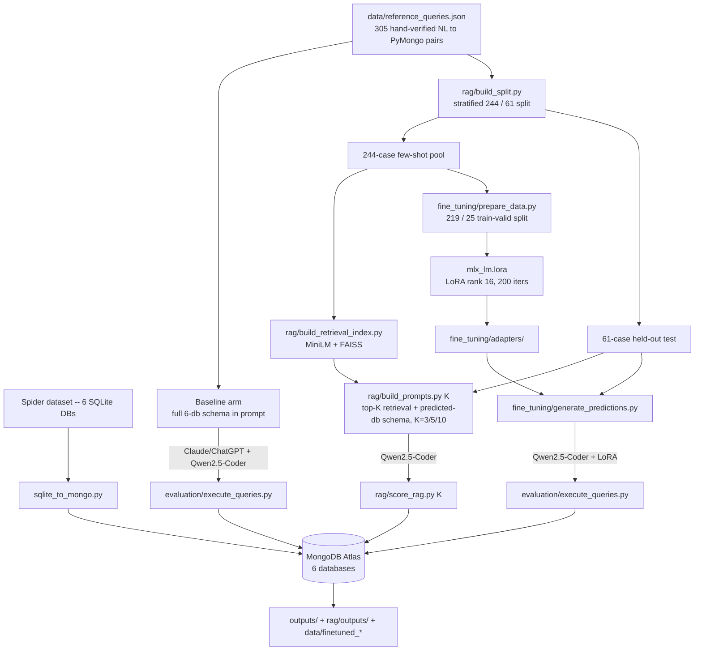

# Capstone Project: Natural Language → MongoDB Query Generation

This repository benchmarks natural-language-to-MongoDB query generation across two axes:
model choice (Claude/ChatGPT vs. Qwen2.5-Coder-1.5B-Instruct) and adaptation strategy for
the small model (a full-schema zero-shot baseline, a retrieval-augmented arm swept across
K=3/5/10, and LoRA fine-tuning). All evaluation runs against six Spider-derived databases
loaded into a real MongoDB Atlas cluster, scored by actually executing every generated
query and comparing results to gold output.

## Project workflow

## Databases

Six Spider-derived databases, loaded as MongoDB collections (`database/mongodb/<db>/`):

| Database | Collections |
| --- | --- |
| `concert_singer` | concert, singer, singer_in_concert, stadium |
| `pets_1` | Has_Pet, Pets, Student |
| `network_1` | Friend, Highschooler, Likes |
| `car_1` | car_makers, car_names, cars_data, continents, countries, model_list.json |
| `world_1` | city, country, countrylanguage |
| `dog_kennels` | Breeds, Charges, Dogs, Owners, Professionals, Sizes, Treatment_Types, Treatments |

`data/reference_queries.json` holds **305** hand-verified natural-language question →
PyMongo query pairs across these six databases, each tagged with a complexity level
(easy/medium/hard) and its gold collection(s). This grew from an original 121-case set via
the Spider dataset-expansion pipeline described below.

## Results

### Baseline arm (full 305-case set, complete 6-database schema in every prompt)

| Model | Execution Accuracy | Ran OK |
| --- | ---: | ---: |
| Claude/ChatGPT | 55.4% (169/305) | 93.8% (286/305) |
| Qwen2.5-Coder-1.5B | 4.3% (13/305) | 88.5% (270/305) |

Claude/ChatGPT, a much larger model, comfortably outperforms the 1.5B Qwen model zero-shot -- the
gap is the motivation for the RAG arm below: can retrieval close some of that gap for a
small, locally-runnable model without switching models entirely?

### RAG vs. baseline (matched 61-case held-out slice, same gold, same scoring code, K-swept)

Qwen2.5-Coder-1.5B-Instruct only, comparing the full-schema baseline prompt against a
retrieval-augmented prompt (top-K similar few-shot examples + one retrieved database's
schema), both scored on the identical 61 held-out test ids at every K so the comparison
isn't confounded by different test sets:

| K | Qwen-Baseline (test-slice) | Qwen-RAG | Database retrieval diagnostic |
| ---: | ---: | ---: | ---: |
| 3 | 4.9% (3/61) | 21.3% (13/61) | 95.1% (58/61) |
| 5 | 4.9% (3/61) | 23.0% (14/61) | 96.7% (59/61) |
| 10 | 4.9% (3/61) | 24.6% (15/61) | 96.7% (59/61) |

RAG accuracy rises monotonically with K, consistent with a wider retrieval vote being less
exposed to a couple of noisy nearest hits -- roughly a 3-5x lift over baseline across the
whole K range. At `n=61` the worst-case standard error on any of these proportions is
still ~±6 points, so treat differences between adjacent K values as directional, not
precise; the baseline-vs-RAG gap itself is large enough to be a clear signal regardless.

### Fine-tuning vs. baseline and RAG (same matched 61-case held-out slice)

Qwen2.5-Coder-1.5B-Instruct, LoRA-fine-tuned (rank 16, 200 iterations, MLX-LM) against the 219-example training split of the same few-shot pool
RAG retrieves from, then evaluated zero-shot (same full-schema prompt as the baseline arm)
on the identical 61 held-out ids:

| Arm | Execution Accuracy | Ran OK |
| --- | ---: | ---: |
| Qwen2.5-Coder-1.5B, zero-shot baseline | 4.9% (3/61) | 88.5%* |
| Qwen2.5-Coder-1.5B, RAG (K=3/5/10) | 21.3-24.6% (13-15/61) | -- |
| **Qwen2.5-Coder-1.5B, LoRA fine-tuned** | **32.8% (20/61)** | 95.1% (58/61) |

*full 305-case figure; see the baseline table above.

**Training cost**: final train loss 0.055, val loss 0.059 (both still trending down through
iteration 200, not yet flattened -- see the loss curve below). Peak Metal memory 8.74GB.
Wall-clock time for the full 200-iteration run wasn't captured directly -- the training
console output wasn't redirected to a file -- but the surviving second-half log (iterations
100-200) measures at 141.9s (2.37 min) of actual wall time for that half, at an average
0.889 it/sec / 2094 tokens/sec. If the first half ran at a similar steady-state rate, the
full run was on the order of ~4-5 minutes of training-step time, plus some additional,
unmeasured model-load/compile overhead at startup -- stated here as an estimate, not a
measured figure. See `fine_tuning/visualize_results.ipynb` for the full derivation.

Fine-tuning outperforms every RAG K value and the zero-shot baseline by a wide margin --
the strongest-performing arm on the small model. This was not the expected outcome going
in: a rank-16 adapter touching only 0.68% of the model's parameters, trained on 219
examples, was expected to land closer to RAG than ahead of it, since RAG can hand the
model concrete worked examples at inference time that a small adapter has to encode as a
general rule instead. The working theory for why fine-tuning still came out ahead: RAG's
retrieved few-shot context can itself introduce noise or added length that a 1.5B model's
in-context reasoning has to work through, while the fine-tuned model has one consistent
behavior baked into its weights with no retrieval step that can go wrong. Not yet verified
with a direct case-by-case comparison of the two arms' misses.

Of the 41 non-matching cases: 3 hard failures (syntax/safety-check rejections plus one
`$size`-misused-as-a-filter-value MongoDB error -- the same operator-misuse bug class also
seen in the RAG arm), 11 ran but returned an empty result, and 27 ran with a non-empty but
incorrect result (missing type casts, skipped joins, and similar patterns also observed in
the RAG arm's own failure analysis).

## RAG design

- **Retrieval**: dense semantic search only (`all-MiniLM-L6-v2` embeddings, FAISS
  `IndexFlatIP`) against a 244-example
  few-shot pool. Verified failure analysis shows retrieval
  itself accounts for only ~1/61 misses (~2%).
- **K is a parameter** (`python rag/build_prompts.py [K]`, default 10), swept at
  3/5/10 on the identical split so K's effect isn't confounded with dataset-size changes.
- **Database prediction**: majority vote across the top-K retrieved neighbors' source
  database (ties broken by the nearest neighbor), not a separate schema-retrieval index --
  reuses the one embedding call already being made for few-shot retrieval.
- **Schema scope**: once a database is predicted, its *entire* schema (every collection)
  is included in the prompt, not a filtered subset -- avoids leaving out a collection a
  `$lookup` join needs even when the database prediction itself is correct.
- **Split**: 305 reference queries stratified by database into a 244-example few-shot pool
  and a 61-example held-out test set (`rag/build_split.py`, fixed random seed), asserted to
  have zero id overlap.

## Fine-tuning design

- **Method**: LoRA (rank 16, scale 2.0, 16 layers, 200 iterations -- ~4 epochs over the
  training split), via MLX-LM, trained locally. 0.68% of the
  model's 1.54B parameters are trainable (10.55M).
- **Data**: `fine_tuning/prepare_data.py` splits the same 244-case few-shot pool RAG uses
  into 219 train / 25 validation examples (90/10, stratified by database), with two
  independent hard leakage checks (id overlap and exact question-text overlap) against the
  61-case held-out test set -- both zero. The held-out set itself is never touched for
  training.
- **Training-target style**: every training example uses the exact same full 6-database
  schema `SYSTEM_PROMPT` as the zero-shot baseline arm (not RAG's retrieved-schema
  format), so the fine-tuned arm's zero-shot score is directly comparable to the baseline
  number rather than entangled with the RAG arm's design.
- **Serving**: generation runs directly off the trained LoRA adapter via `mlx_lm`
  (`fine_tuning/generate_predictions.py`).

## Visualizations

Each pipeline stage owns the figures specific to it; anything that needs data from more
than one stage lives in a separate cross-arm notebook instead, so no single stage's
notebook has to reach outside its own folder.

### Fine-tuning arm (`fine_tuning/visualize_results.ipynb` -> `fine_tuning/outputs/figures/`)

| Figure | Shows |
| --- | --- |
| `finetuned_vs_all_arms.png` | Baseline vs. RAG (K=10) vs. fine-tuned execution accuracy, three-way bar chart. |
| `finetuned_outcome_breakdown.png` | Fine-tuned arm's 61 cases split into correct / ran-wrong / ran-empty / hard-failure. |
| `finetuned_loss_curve.png` | LoRA training/validation loss vs. iteration. **Partial**: `mlx_lm.lora`'s console output wasn't redirected to a log file during the real run, so only the surviving iterations 100-200 (of 200) are plotted; iterations 1-99 are not available and are not estimated. |

### Cross-arm comparison (`visualize_cross_arm_comparison.ipynb` -> `outputs/figures/`)

The one notebook that compares *across* stages -- baseline (Qwen and Claude), RAG, and
fine-tuning -- on the identical matched 61-case holdout (plus two full-305 baseline
breakdowns for the Stage-1 headline numbers).

| Figure | Shows |
| --- | --- |
| `rag_outcome_breakdown.png` | RAG (K=10) outcome breakdown, 61-case holdout. |
| `baseline_qwen_outcome_breakdown.png` | Qwen zero-shot baseline outcome breakdown, full 305-case set. |
| `baseline_claude_outcome_breakdown.png` | Claude baseline outcome breakdown, full 305-case set. |
| `all_arms_outcome_composition.png` | All four arms' outcome mix, one 100%-stacked bar per arm, matched 61-case holdout. |
| `accuracy_by_complexity.png` | Execution accuracy by question complexity (easy/medium/hard), all four arms, matched 61-case holdout. |
| `rag_vs_finetuned_correct_overlap.png` | Which of the 61 cases RAG and fine-tuned each get right -- both, one-only, or neither. |
| `bug_taxonomy_by_arm.png` | Every non-correct case classified into a failure-mode bucket (blocked pre-execution, invalid-operator misuse, runtime DB error, missing join, missing type cast, or unclassified), per arm. |

A few findings from these that the headline numbers alone don't show:

- **Qwen's zero-shot baseline fails differently than every other arm.** 56.7% of its
  305-case misses are *empty results*, not wrong-but-confident answers -- the small model
  mostly gives up rather than hallucinating, unlike RAG, fine-tuned, or Claude, where
  "ran but wrong" dominates instead.
- **Fine-tuning's overall lead over RAG is not uniform across difficulty.** It comes
  entirely from medium-complexity cases (46.4% vs. RAG's 25.0%) -- on hard-complexity
  cases fine-tuning scores 0/12 while RAG still gets 2/12. "Fine-tuning beats RAG" holds
  in aggregate but not case-by-case.
- **RAG and fine-tuned get different cases right, not just different rates.** They agree
  on 10 correct cases, but RAG uniquely solves 5 more and fine-tuned uniquely solves 10
  more -- their union covers 25/61 (41.0%), well above either arm alone. Of the 36 cases
  neither solves, Claude also misses 26, so these are genuinely the hardest cases in the
  set, not a small-model-specific gap.
- **The zero-shot baseline's single biggest identifiable failure mode is a missing
  `$lookup`** -- 25.9% of its misses, vs. 15.2% (RAG) and 19.5% (fine-tuned) -- a specific,
  mechanical join-skipping gap that both RAG (via retrieved examples) and fine-tuning (via
  training data) only partially close.
