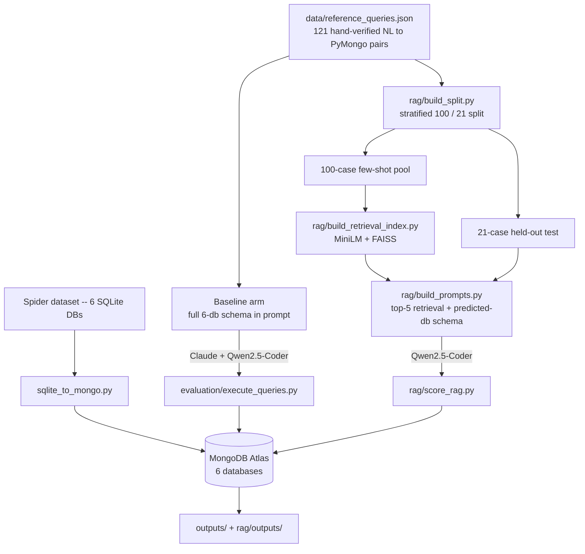

# Capstone Project: Natural Language → MongoDB Query Generation

This repository benchmarks natural-language-to-MongoDB query generation across two axes:
model choice (Claude vs. Qwen2.5-Coder-1.5B-Instruct) and prompting strategy (a
full-schema zero-shot baseline vs. a retrieval-augmented arm). All evaluation runs
against six Spider-derived databases loaded into a real MongoDB Atlas cluster, scored
by actually executing every generated query and comparing results to gold output --
not by string-matching the query text.

## Project workflow

## Databases

Six Spider-derived databases, loaded as MongoDB collections (`database/mongodb/<db>/`):

| Database | Collections |
| --- | --- |
| `concert_singer` | concert, singer, singer_in_concert, stadium |
| `pets_1` | Has_Pet, Pets, Student |
| `network_1` | Friend, Highschooler, Likes |
| `car_1` | car_makers, car_names, cars_data, continents, countries, model_list.json |
| `world_1` | city, country, countrylanguage |
| `dog_kennels` | Breeds, Charges, Dogs, Owners, Professionals, Sizes, Treatment_Types, Treatments |

`data/reference_queries.json` holds 121 hand-verified natural-language question → PyMongo
query pairs across these six databases, each tagged with a complexity level
(easy/medium/hard) and its gold collection(s).

## Results

### Baseline arm (full 121-case set, complete 6-database schema in every prompt)

| Model | Execution Accuracy | Non-Empty Rate | Ran OK | CodeBLEU | BERTScore F1 |
| --- | ---: | ---: | ---: | ---: | ---: |
| Claude | 69.42% | 95.04% | 95.04% | 0.4647 | 0.7454 |
| Qwen2.5-Coder-1.5B | 6.61% | 30.58% | 88.43% | 0.4208 | 0.5352 |

Claude, a much larger model, comfortably outperforms the 1.5B Qwen model zero-shot -- the
gap is the motivation for the RAG arm below: can retrieval close some of that gap for a
small, locally-runnable model without switching models entirely?

### RAG vs. baseline (same 21-case held-out slice, same gold, same scoring code)

Qwen2.5-Coder-1.5B-Instruct only, comparing the full-schema baseline prompt against a
retrieval-augmented prompt (top-5 similar few-shot examples + one retrieved database's
schema), both scored on the identical 21 held-out test ids so the comparison isn't
confounded by different test sets:

| Arm | Correct | Total | Accuracy |
| --- | ---: | ---: | ---: |
| Qwen-Baseline (test-slice) | 0 | 21 | 0.00% |
| Qwen-RAG | 5 | 21 | 23.81% |
| Database retrieval diagnostic | 20 | 21 | 95.24% |

Retrieval-augmented prompting took this test slice from 0% to 23.81% execution accuracy
for the small model -- a meaningful signal, though `n=21` means the standard error on
this proportion is roughly ±11 points, so treat it as directional, not precise.

## RAG design

- **Retrieval**: dense semantic search only (`all-MiniLM-L6-v2` embeddings, FAISS
  `IndexFlatIP` / cosine similarity over L2-normalized vectors) against a 100-example
  few-shot pool -- no lexical/BM25 component. At this corpus size (100 vectors) an exact
  flat index is the right fit; no approximate index or hybrid retrieval is warranted.
- **Database prediction**: majority vote across the top-5 retrieved neighbors' source
  database, not a separate schema-retrieval index. This reuses the one embedding call
  already being made for few-shot retrieval.
- **Schema scope**: once a database is predicted, its *entire* schema (every collection)
  is included in the prompt, not a filtered subset -- avoids leaving out a collection a
  `$lookup` join needs even when the database prediction itself is correct.
- **Split**: 121 reference queries stratified by database into a 100-example few-shot
  pool and a 21-example held-out test set (`rag/build_split.py`, fixed random seed),
  asserted to have zero id overlap.

## Dataset expansion (in progress)

The 121-case reference set is small for robust RAG evaluation. Rather than adding more
Spider databases, the project is expanding within the existing 6 databases (Spider's own
benchmark tests cross-domain generalization to *unseen* databases, a different problem
from this project's in-domain few-shot retrieval). `rag/select_spider_candidates.py`
pulled unused Spider examples for these 6 databases, and `rag/dedup_check.py` checked
them against the existing 121 for near-duplicate phrasing and structural overlap. Current
state: **202 deduped candidates** selected across the 6 databases
(`rag/data/spider_candidates.json`), weighted toward medium/hard complexity. Still
pending: SQL → PyMongo translation and Atlas verification for each candidate, then a
rebuilt, larger split and a re-run of both arms on the new test set.

## Repository layout

- `data/` -- reference queries and baseline-arm evaluation artifacts, shared across arms.
- `database/mongodb/` -- the six databases' collection dumps (also the source Atlas is
  loaded from).
- `evaluation/` -- shared scoring harness (`execute_queries.py`, `execute_gold.py`) used
  by both the baseline and RAG arms, so there's one scoring implementation, not two.
- `rag/` -- everything RAG-specific: pipeline code, `rag/data/` (split, FAISS index,
  prompts, predictions, dataset-expansion candidates), `rag/outputs/` (the baseline-vs-RAG
  comparison), and the RAG inference notebook.
- `outputs/` -- baseline-arm evaluation results and figures (execution accuracy, CodeBLEU,
  BERTScore).
- `docs/BACKLOG.md` -- living issue tracker; see it for currently open items.
- `mongodb_nl_to_sql_1.ipynb` -- baseline-arm Qwen inference (Colab).
- `rag/mongodb_nl_to_sql_rag.ipynb` -- RAG-arm Qwen inference (Colab).

## Setup

1. Load the six databases into Atlas: `python sqlite_to_mongo.py` (SQLite → JSON dumps
   under `database/mongodb/`), then `python atlas_verify_and_load.py` to load/verify them
   against your cluster. Both expect Atlas credentials in `atlas-credentials.env`
   (gitignored -- never commit this file).
2. Baseline arm: run `mongodb_nl_to_sql_1.ipynb` in Colab, then
   `python normalize.py <raw_results.json> <normalized.json>` and
   `python evaluation/execute_queries.py` locally (needs an Atlas connection).
3. RAG arm: locally run `python rag/build_split.py`, `python rag/build_retrieval_index.py`,
   `python rag/build_prompts.py` (CPU only, no Atlas needed), then
   `rag/mongodb_nl_to_sql_rag.ipynb` in Colab, then
   `python normalize.py rag/data/qwen_rag_results.json rag/data/qwen_rag_normalized.json`
   and `python rag/score_rag.py` locally (needs Atlas).
