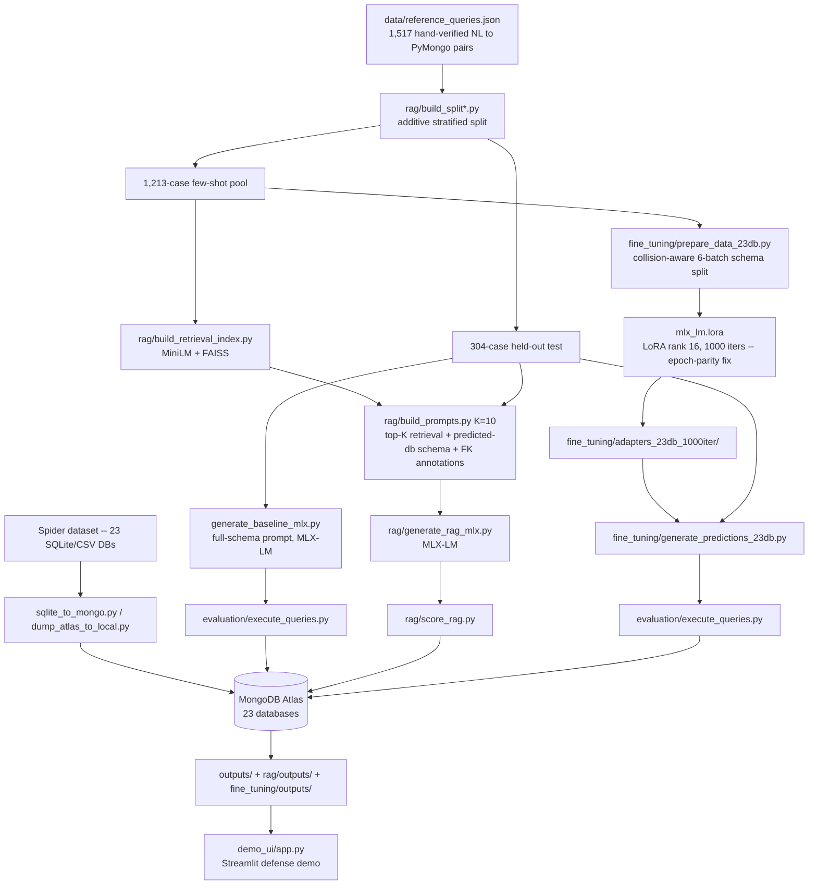

# Capstone Project: Natural Language → MongoDB Query Generation

This repository benchmarks natural-language-to-MongoDB query generation across two axes:
model choice (Claude/ChatGPT vs. Qwen2.5-Coder-1.5B-Instruct) and adaptation strategy for
the small model (a full-schema zero-shot baseline, a retrieval-augmented arm, and LoRA
fine-tuning). The dataset has grown across three expansion rounds from an original 6
Spider-derived databases / 305 cases to **23 databases / 1,517 hand-verified NL→PyMongo
pairs**, all loaded into a real MongoDB Atlas cluster and scored by actually executing
every generated query and comparing results to gold output — never by string match.

**All three Qwen arms (baseline, RAG, fine-tuned) now generate on the same serving stack**:
MLX-LM, run locally on Apple Silicon. This replaced an earlier Colab/HF-`transformers`
(fp16 GPU) path for baseline and RAG.

## Project workflow


```mermaid
graph TD
    Spider[Spider dataset -- 23 SQLite/CSV DBs] --> Convert[sqlite_to_mongo.py / dump_atlas_to_local.py]
    Convert --> Atlas[(MongoDB Atlas\n23 databases)]

    Ref[data/reference_queries.json\n1,517 hand-verified NL to PyMongo pairs] --> Split[rag/build_split*.py\nadditive stratified split]
    Split --> Pool[1,213-case few-shot pool] --> Index[rag/build_retrieval_index.py\nMiniLM + FAISS]
    Split --> Test[304-case held-out test]

    Test --> BaseGen[generate_baseline_mlx.py\nfull-schema prompt, MLX-LM]
    BaseGen --> Score1[evaluation/execute_queries.py]

    Index --> Prompts[rag/build_prompts.py K=10\ntop-K retrieval + predicted-db schema + FK annotations]
    Test --> Prompts
    Prompts --> RagGen[rag/generate_rag_mlx.py\nMLX-LM]
    RagGen --> Score2[rag/score_rag.py]

    Pool --> FTData[fine_tuning/prepare_data_23db.py\ncollision-aware 6-batch schema split]
    FTData --> Train[mlx_lm.lora\nLoRA rank 16, 1000 iters -- epoch-parity fix]
    Train --> Adapter[fine_tuning/adapters_23db_1000iter/]
    Adapter --> FTGen[fine_tuning/generate_predictions_23db.py]
    Test --> FTGen
    FTGen --> Score3[evaluation/execute_queries.py]

    Score1 --> Atlas
    Score2 --> Atlas
    Score3 --> Atlas

    Atlas --> Results[outputs/ + rag/outputs/ + fine_tuning/outputs/]
    Results --> Demo[demo_ui/app.py\nStreamlit defense demo]
```

## Databases

23 Spider-derived databases, loaded as MongoDB collections (`database/mongodb/<db>/`).
The original 6 (`concert_singer`, `pets_1`, `network_1`, `car_1`, `world_1`, `dog_kennels`)
were expanded with 7 more in round 2 and 10 more in round 3:

| Database | Collections | Database | Collections | Database | Collections |
| --- | ---: | --- | ---: | --- | ---: |
| apartment_rentals | 6 | csu_1 | 6 | pets_1 | 3 |
| baseball_1 | 26 | dog_kennels | 8 | sakila_1 | 12 |
| bike_1 | 4 | flight_2 | 3 | store_1 | 11 |
| car_1 | 6 | flight_4 | 3 | wine_1 | 3 |
| chinook_1 | 11 | formula_1 | 11 | world_1 | 3 |
| college_1 | 7 | hr_1 | 7 | wta_1 | 3 |
| college_2 | 11 | inn_1 | 2 | | |
| college_3 | 8 | network_1 | 3 | | |
| concert_singer | 4 | | | | |

`data/reference_queries.json` holds **1,517** hand-verified natural-language question →
PyMongo query pairs across these 23 databases (305 → 735 → 1,517 across three expansion
rounds), each tagged with a gold collection set and, a complexity level
(easy/medium/hard). Split additively (not reshuffled) into
a **1,213-case few-shot pool** (`rag/data/rag_fewshot_pool.json`) and a **304-case
held-out test set** (`rag/data/rag_test.json`), with zero id or question-text overlap
between them, verified independently of every prior round's split.

## Why the serving stack matters

Earlier rounds generated baseline and RAG via Colab + HF `transformers` in fp16 on a
shared GPU, while fine-tuning ran locally via MLX-LM on Apple Silicon (bf16). That
turned out to be a real confound- fp16 GPU inference
without deterministic-algorithm flags is **not bit-identical across separate Colab
sessions**, even under greedy decoding — verified directly by generating an identical
prompt-content change and its full revert back-to-back in one session and getting
byte-for-byte identical output, which is only possible if a *session boundary*, not the
code, drove an earlier apparent accuracy swing.

Once RAG was re-measured on the same MLX-LM stack as fine-tuning, RAG's accuracy on the
original, unchanged 61-case matched slice rose from 24.6% to **50.8%** — more than
double, on identical questions, identical gold, identical scoring code, with only the
serving stack changed. That reversed this project's earlier reported conclusion
("LoRA fine-tuning beats RAG at every K tested") — RAG is the stronger arm once every
arm sits on the same stack. `generate_baseline_mlx.py`, `rag/generate_rag_mlx.py`, and
`fine_tuning/generate_predictions_23db.py` are the current, unified generation scripts;
the Colab-based baseline/RAG scripts remain in the repo for the historical 305-case
Stage 1 result only (see below).

## Results (current, full 304-case test set, unified MLX-LM stack)

| Arm | Execution Accuracy | Outcome mix: correct / wrong-nonempty / empty / hard-fail |
| --- | ---: | --- |
| Zero-shot baseline | 4.9% (15/304) | 15 / 68 / 172 / 49 |
| RAG (K=10, FK-included, canonical) | 46.7% (142/304) | 141 / 86 / 63 / 14&nbsp;\* |
| LoRA fine-tuned (23-db, 1000-iter epoch-parity retrain) | **33.9% (103/304)** | 103 / 105 / 80 / 16 |

<sub>\* RAG's canonical score (142/304, FK-included) is the aggregate CSV figure; a
later FK-vs-no-FK A/B test run (see below) overwrote the FK variant's case-level
execution-results JSON, so the outcome-mix breakdown above uses the surviving no-FK
case file (141/304 correct) — 1 case off the canonical aggregate, well inside noise,
and documented rather than silently substituted.</sub>

RAG is the clear leader on the current full-scale comparison. Fine-tuning still clears
the zero-shot baseline by a wide margin (~7x) but trails RAG by a real margin even after
its own methodology bug (below) was fixed.


### Accuracy by complexity (304-case test set)

| Complexity | n | Baseline | RAG | Fine-tuned |
| --- | ---: | ---: | ---: | ---: |
| Easy | 75 | 9.3% | 60.0% | 54.7% |
| Medium | 111 | 4.5% | 40.5% | 28.8% |
| Hard | 39 | 0.0% | 28.2% | 17.9% |
| Unknown&nbsp;\* | 79 | 3.8% | 50.6% | 29.1% |

<sub>\* 79 cases, all from the newest expansion round, have no `complexity` value in
`data/reference_queries.json` — a genuine data-quality gap, surfaced as its own bucket
rather than dropped or force-fit into another one.</sub>

### RAG vs. fine-tuned: different cases, not just different rates

Correct-set overlap out of 304: **both** arms correct on 64 cases, **RAG-only** 77,
**fine-tuned-only** 39, **neither** 124 — union 180/304 (59.2%), well above either arm
alone. The two arms fail on substantially different cases, not just at different rates.

### FK schema annotations — A/B tested, null result

Whether including foreign-key annotations in the RAG prompt's schema block helps was
tested as a controlled A/B run on MLX-LM - **FK-included 142/304 (46.7%) vs. no-FK 141/304
(46.4%)**. A 1-case, 0.3-point difference. FK annotations don't measurably help
or hurt on top of what schema + few-shot examples already provide.

## Ground-truth and scorer verification

Two independent audits were added, both reproducible from a clean checkout and
neither needing an Atlas connection. Which file each published number comes
from — and which same-named sibling is superseded — is now recorded in
[`CANONICAL_ARTIFACTS.md`](CANONICAL_ARTIFACTS.md).

### 1. Is the gold data right? SQL ↔ PyMongo cross-check

[`evaluation/crosscheck_sql_gold.py`](evaluation/crosscheck_sql_gold.py) checks
the hand-written PyMongo gold against **Spider's own gold SQL**, executed on
Spider's original SQLite databases. All 23 databases are present in the Spider
distribution, and all **1,396** Spider-derived cases match a Spider example on
`(db_id, question text)` exactly, so the SQL is fully recoverable. The Mongo side
is read from the already-executed `data/gold_results.json`; only the SQL side is
run, locally.

**1,409 cases execute on both sides; 1,264 (89.7%) agree** — 87.2% on the
304-case test slice. Zero SQL errors. The comparison is value-based and tolerant
of column naming, column order, row order, float representation, `$facet`
set-difference shapes, and Mongo carrying an extra computed column the SQL
doesn't project, so what remains is semantic rather than cosmetic.

The 145 disagreements are auto-classified into causes in
`outputs/sql_crosscheck.csv`, and most are **not** gold defects:

| Likely cause | n | What it means |
| --- | ---: | --- |
| `UNCLASSIFIED` | 43 | No pattern matched — read these first. |
| `TEXT_TYPED_NUMERIC` | 38 | The column is TEXT in SQLite and a string in Mongo. SQL compares it numerically; a plain `$gt` on a string silently matches nothing. |
| `TIE_OR_RANK` | 37 | `ORDER BY x LIMIT 1` with a **tie** at the top. |
| `AGGREGATE_OVER_TEXT` | 12 | SQL `AVG`/`SUM` coerces TEXT; Mongo's `$avg` over a string yields null without `$toDouble`. |
| `SET_OP` | 7 | SQL `EXCEPT`/`INTERSECT`, expressed in Mongo via `$facet`. |
| `JOIN_FANOUT` | 6 | Same distinct rows, different row counts — one side's join duplicates. |
| `SUBQUERY` | 2 | Correlated/nested `SELECT`. |

The most interesting class is `TIE_OR_RANK`: **the question itself is
under-determined**. `spider-network_1-7` asks which grade has the most high
schoolers when grades 9, 10, 11 and 12 all have exactly 4 — SQL's arbitrary pick
is 12, the gold PyMongo adds an `_id` tiebreak and picks 9. A model answering
"12" is scored wrong for giving an equally correct answer. That is a property of
the questions, not of either query language, and it caps how high any arm's
measurable accuracy can go.

Gold health separately: **0** of 1,517 gold queries fail to execute and only
**4** return empty (`spider-flight_2-37/38/75/76`, all `flight_2`).

### 2. Is the *scorer* right? False-positive audit

[`evaluation/audit_false_positives.py`](evaluation/audit_false_positives.py)
asks the complementary question: how often does a **semantically wrong** query
score correct because its *result* happened to match? `results_match()` compares
result sets, and four properties of that let a wrong query through — empty
matches empty, scalar matches scalar by coincidence, order is never compared,
and low-cardinality collections make "top N" degenerate.

The script flags candidates mechanically and keeps human verdicts in a registry
keyed by **(arm, id)** — a false positive is a property of a generated query,
not of a test case. That distinction is load-bearing: on `spider-flight_2-75`
and `spider-apartment_rentals-29`, fine-tuning's query is defective while RAG's
is correct, so an id-keyed registry would have blamed RAG for both.

| Arm | Published | AST-identical to gold | Confirmed false positives | Corrected |
| --- | ---: | ---: | ---: | ---: |
| Zero-shot baseline | 15/304 (4.9%) | 3 | 2 (13.3% of correct) | 13/304 (4.3%) |
| RAG (K=10) | 141/304 \* | 72 | **3 (2.1%)** | 138/304 (45.4%) |
| LoRA fine-tuned | 103/304 (33.9%) | 51 | **9 (8.7%)** | 94/304 (30.9%) |

<sub>\* the case-level file surviving the FK A/B overwrite; the canonical
aggregate is 142/304 — see [`CANONICAL_ARTIFACTS.md`](CANONICAL_ARTIFACTS.md).</sub>

Representative confirmed cases: fine-tuning filters `DestAirport` where the
question says *departing* (`spider-flight_2-75` — both return 0, and empty
matches empty); drops the `PetType == "cat"` filter and matches on age alone
(`spider-pets_1-20`); drops the `COMMISSION_PCT != null` filter
(`spider-hr_1-65`); averages a **string** `room_count` and returns the top-3 in
the wrong ranking, which passes because there are exactly 3 distinct values
(`spider-apartment_rentals-29`). RAG reverses a sort direction on "worked
longest" over a collection of ≤10 employees (`spider-store_1-26`).

Errors run the other way too — 6 RAG, 2 fine-tuned and 2 baseline cases are
scored wrong when a stricter reading says they are right, most because the model
simply didn't project `_id` away.

**The headline conclusion survives, and strengthens.** Fine-tuning's
false-positive rate is **4× RAG's**, which is what the mechanism predicts: LoRA
teaches the *shape* of a correct query, so it emits structurally plausible
pipelines with wrong predicates — exactly the failure mode result-comparison
cannot see. Correcting both directions widens the RAG-vs-fine-tuned gap from
12.8 to ~15.4 points.

Both audits write CSVs (`outputs/false_positive_audit.csv`,
`outputs/sql_crosscheck.csv`) and neither modifies any published number.

```bash
python evaluation/audit_false_positives.py
python evaluation/crosscheck_sql_gold.py --spider-root ../spider_data
```

## Secondary metrics: CodeBLEU and BERTScore

Execution accuracy (above) is this project's primary metric throughout — a query is
scored by whether it returns the correct result when actually run, not by how closely
its text resembles a reference. Two secondary, literature-comparability metrics were
recomputed against the current, full 304-case test set:

| Arm | n | CodeBLEU (3-component, canonical) | CodeBLEU (full, 4-component) |
| --- | ---: | ---: | ---: |
| Baseline (zero-shot) | 304 | 0.2270 | 0.4203 |
| RAG (K=10, FK-included) | 304 | 0.2783 | 0.4587 |
| Fine-tuned (23-db, 1,000-iter) | 304 | 0.2759 | 0.4570 |

The 3-component score (n-gram, weighted n-gram, syntax match) is this project's
canonical CodeBLEU figure — the 4th component, dataflow match, is designed for
multi-statement code and degenerates to zero for the single-expression PyMongo output
this task produces, so including it would silently deflate every arm's score by a
constant, uninformative amount rather than measure anything real.

**RAG and fine-tuning score within 0.0024 of each other on CodeBLEU (0.2783 vs. 0.2759)
despite a 12.8-percentage-point gap in execution accuracy (46.7% vs. 33.9%)** — on this
secondary metric the two arms look nearly indistinguishable, while on the metric this
project treats as authoritative they are clearly separated. See
`outputs/figures/codebleu_vs_execution_accuracy_304.png` and
`outputs/codebleu_scores_304.csv`. This is not a contradiction: CodeBLEU rewards
surface-level lexical/syntactic similarity to a single reference query, while execution
accuracy asks whether the generated query actually returns the correct result — a query
can borrow much of the reference's shape while filtering on the wrong condition, and a
semantically correct query can legitimately diverge from the reference's literal token
sequence and lose CodeBLEU credit for it regardless.

**BERTScore F1 has not been recomputed at this scale.** Both compute environments
available for this update sit behind a network restriction that blocks the Hugging Face
Hub download BERTScore's underlying `roberta-large` model requires — confirmed directly
in both environments (`OSError` resolving the model config; `httpx.ProxyError: 403
Forbidden`), not assumed. A complete, ready-to-run script,
[`compute_bertscore_304.py`](compute_bertscore_304.py) — mirroring this project's
established BERTScore methodology exactly (`lang="en"`, `rescale_with_baseline=True`) —
is included in this repository; running it needs only an environment with unrestricted
Hugging Face Hub access. Both metrics were previously measured once, early in the
project, on a 121-case subset (CodeBLEU: Claude 0.272, Qwen 0.225; BERTScore F1: Claude
0.672, Qwen 0.472) but not at the current, full 304-case scale until this update.

## Fine-tuning: the epoch-parity fix

When the fine-tuning arm was retrained to cover all 23 databases (up from the original
6), its LoRA config initially carried over `iters: 200` unchanged from the 6-db run —
a deliberate controlled variable at the time, but it produced a real, undiagnosed
under-training bug: the 6-db adapter's 200 iterations covered ~3.65 epochs of its
219-example training set, while the same 200 iterations over the 23-db run's larger
1,091-example set covered under 0.75 of a single epoch. Restoring the same ~3.65-epoch
*coverage* (not the same raw iteration count) meant raising `iters` to **1,000**
(`fine_tuning/lora_config_23db_1000iter.yaml`; every other hyperparameter — rank, layers,
batch size, learning rate — held identical). Result: **73/304 (24.0%) → 103/304
(33.9%)**, a real, substantial recovery. **This 1,000-iteration adapter and its 33.9%
figure are the current, canonical fine-tuning result** — an earlier 200-iteration
adapter's 24.0% figure, and any chart generated before this retrain, is superseded.

An earlier bug in the same pipeline, fixed separately before this: the 23 databases are
split into fixed batches for training (a **batched schema** design — each training
example sees only its own database's batch schema, up to 4 databases per batch, keeping
prompt length close to the original single-database design's size class rather than a
~6x-longer 23-database monolith). The first version of this batching sorted databases
alphabetically with no awareness of which ones resemble each other, which put the three
near-identical `college_1`/`college_2`/`college_3` databases (same schema, three
different field-naming conventions) in one training batch — the model learned to answer
`college_3` questions using `college_1`'s or `college_2`'s field names. Fixed with a
collision-aware greedy batching algorithm driven by an explicit `COLLISION_GROUPS` list
in `fine_tuning/prepare_data_23db.py` (also covering `chinook_1`/`store_1`,
`flight_2`/`flight_4`, `store_1`/`sakila_1`); `college_3` recovered from 0% correct to
positive double digits once separated from its naming-convention siblings.

Fine-tuning specifics: LoRA rank 16, scale 2.0, 16 layers, dropout 0.0 — 0.68% of the
model's 1.54B parameters trainable (10.55M) — trained via `mlx_lm.lora` on
`fine_tuning/data_23db/` (1,091 train / 122 valid examples, built from the 1,213-case
few-shot pool with two independent leakage checks — id overlap and question-text overlap
against the 304-case test set, both zero). Final train loss 0.030, val loss 0.024, peak
Metal memory ~15.4GB.

## RAG design

- **Retrieval**: dense semantic search only (`all-MiniLM-L6-v2` embeddings, FAISS
  `IndexFlatIP`) against the 1,213-example few-shot pool.
- **K=10** (`python rag/build_prompts.py 10`), the setting used for the canonical
  304-case result; a K=3/5/10 sweep on the earlier, smaller matched-61 slice showed
  accuracy rising monotonically with K.
- **Database prediction**: majority vote across the top-K retrieved neighbors' source
  database — 258/304 (84.9%) database-retrieval accuracy across the current 23 candidate
  databases (down from 96.7% on the original 6-database slice, as expected for a harder
  23-way retrieval problem).
- **Schema scope**: once a database is predicted, its entire schema (every collection)
  is included in the prompt, with FK-relationship annotations included by default
  (A/B tested against omitting them — see above, a null result either way).
- **Serving**: generation runs via `rag/generate_rag_mlx.py` against MLX-LM directly,
  using each case's own retrieved schema/few-shot prompt from `rag/data/rag_prompts.json`.

## Demo UI

`demo_ui/app.py` is a Streamlit app built for live capstone-defense presentation:
Baseline / RAG / Fine-Tuned / Compare-All-3 tabs replay 5 curated, source-verified
example cases (zero model loading, cannot fail or hang) pulled directly from this
project's own execution-result JSON files and re-verified against the current
epoch-parity-fixed (1000-iteration) fine-tuned adapter. A fifth, experimental
Live Inference tab actually loads Qwen2.5-Coder-1.5B via MLX and generates a fresh
answer for any typed question, reusing the repo's own prompt-building and generation
code (`rag/build_prompts.py`, `generate_baseline_mlx.py`, `evaluation/execute_queries.py`)
rather than a separate implementation. See `demo_ui/README.md` for setup and the
curated-vs-live tradeoffs.

```bash
source .venv/bin/activate
pip install streamlit    # already in requirements.txt
streamlit run demo_ui/app.py
```

## Visualizations

`visualize_cross_arm_304.py` reproduces the earlier 61-case cross-arm notebook's figure
set against the full, current 304-case, MLX-unified results, written to
`outputs/figures/` (all `_304`-suffixed): `baseline_outcome_breakdown_304.png`,
`rag_outcome_breakdown_304.png`, `finetuned_outcome_breakdown_304.png`,
`all_arms_outcome_composition_304.png`, `accuracy_by_complexity_304.png`,
`rag_vs_finetuned_correct_overlap_304.png`, `bug_taxonomy_by_arm_304.png`,
`finetuned_accuracy_by_database_304.png`, plus `visualize_final_comparison.py`'s
`final_arm_comparison_n304.png` and `old_run_vs_current_run.png`.

**Now current, staleness resolved**: all figures above were regenerated against the
current 1,000-iteration, epoch-parity-fixed fine-tuned adapter (33.9%) rather than the
superseded 200-iteration run (24.0%) — closing a gap this README previously flagged
explicitly rather than silently. Two incidental bugs were fixed in the same pass: a
funnel-chart title-clipping defect (`draw_funnel()`'s figure width) and a deprecated
`matplotlib.pyplot.cm.get_cmap` call.

Two further figures were added this round, also in `outputs/figures/`:
`finetuned_23db_1000iter_loss_and_memory.png` — train/validation
loss and peak Metal memory vs. iteration over the full 1,000-iteration run, two stacked
panels sharing an x-axis rather than a dual y-axis. Its source data,
`fine_tuning/training_log_1000iter.txt`, is committed; the `plot_training_curve.py` script
this README previously credited is **not in the repo** and never was, so the figure is
currently not regenerable from a clean clone — flagged here rather than left as a
dangling reference. Also added — 
`codebleu_vs_execution_accuracy_304.png` (`visualize_codebleu_304.py`) — execution
accuracy and CodeBLEU (3-component) side by side for all three arms, see
[Secondary Metrics](#secondary-metrics-codebleu-and-bertscore) above.

## Run provenance, confidence, and what a re-run actually reproduces

Every generation and prompt-build step now writes a sibling `<name>.manifest.json`
recording what produced the artifact next to it: model, adapter, `max_tokens`, decoding
mode, `TOP_K`, whether FK annotations were on, the embedding model and FAISS index size,
library versions, the git SHA, whether the tree was dirty, and a SHA-256 of the results
file itself ([`run_manifest.py`](run_manifest.py)). A sibling file rather than a
`_manifest` key inside the JSON, because every results file here is a list and every
consumer iterates it — a dict at the top level would break all of them at once.

This was added because three concrete problems had already happened and nothing in the
repo could have caught any of them.

**1. `rag/build_prompts.py` segfaulted — step 3 below did not run at all.** The venv
carries three separate copies of `libomp.dylib` (torch, faiss, sklearn). Whichever loads
first wins the process, and when faiss's copy won, the first torch forward pass killed
the interpreter: SIGSEGV, exit 139, no traceback, no Python-level error, output ending
silently after `Embedder ready.`. The script imported `faiss` before `embed_utils`
(alphabetical order), so it hit this every time. Reproduced minimally in both directions
and fixed by pinning the import order in `rag/build_prompts.py` and
`rag/build_retrieval_index.py`; both carry a comment saying not to let isort re-sort them
back. **Anyone who tried to rebuild the RAG prompts got a silent crash instead of
prompts.**

**2. `rag/data/qwen_rag_mlx_results.json` is stale and does not correspond to the
prompts committed beside it.** Regenerating from the committed `rag_prompts.json`
reproduces `rag/data/qwen_rag_mlx_fk_results.json` **bit-for-bit on all 304 cases**
(identical text *and* identical per-token logprobs, across two independent runs) — but
differs from `qwen_rag_mlx_results.json` on 103 of 304. The cause is dated: between
commits `32d41f6` and `f396e3d` every one of the 304 `system_prompt`s changed while
every `retrieved_ids` list stayed identical — the schema cards went from 76 cards / 0 FK
edges to 161 cards / 19 FK edges, and rule 7 and the `"null"`-string warning were added.
The results file was generated against the *older* prompts and then committed alongside
the *newer* ones. **The published RAG figure is unaffected** — 142/304 (46.7%) was scored
from the FK artifact, which reproduces exactly; `qwen_rag_mlx_results.json` is a leftover
third file that matches neither A/B variant.

**3. The same thing happened to the baseline arm, for a different reason.** The baseline
uses one fixed system prompt shared by all 304 cases, assembled at runtime from whatever
is dumped under `database/mongodb/` — which is gitignored. When that run was made,
`college_3` and `chinook_1` had no local dump (the script's own docstring says so), so
the shared prompt omitted two databases' schema; all 23 have dumps now. One input change
therefore moved every case, and 181/304 regenerate differently. The current run's manifest
records `schema_coverage.missing: []`, so this specific gap is now closed *and* recorded.

Generation itself is deterministic on this stack: two independent full 304-case runs came
out identical down to the per-token logprobs. What was missing was never determinism — it
was any record of which inputs a given artifact was produced from.

**Problem 3 is now fixed, not just recorded.** `rag/schema_cards.py` falls back to
the committed `rag/schema_cards.json` when `database/mongodb/` is absent, so a clean
clone builds the baseline arm's full-schema prompt instead of silently building a
*schema-free* one. The snapshot is verified byte-identical to a live build, and the
fallback logs loudly that it is a snapshot rather than live schema. Regenerate it with
`python rag/schema_cards.py` after any future dataset expansion.

Two other housekeeping fixes in the same pass. `clean()`, `STOP_MARKERS`,
`clean_with_logprobs()`, `generate_with_logprobs()` and `confidence_fields()` moved out of
`fine_tuning/spot_check.py` — a CLI sanity-check script whose own docstring says it is
"not a scored metric" — into `fine_tuning/generation_utils.py`, which is what five scripts
across all three arms and the demo UI were actually importing. Same functions, byte-identical
post-processing; `spot_check.py` re-exports the names, so any older call site or notebook
still works. And `data/reference_queries.json`'s `complexity` field used three spellings for
one bucket — 16 `high` and 12 `complex` alongside 148 `hard`. Normalized at the source to
`hard` (176). The visualization scripts already mapped `high`/`complex` → `hard`, so the
by-complexity table is unchanged, verified: Easy 75 / Medium 111 / Hard 39 / Unknown 79.

### Confidence signals

Nothing in this repo used to emit a probability anywhere, so no calibration analysis
(ECE, reliability diagrams, temperature scaling) was possible from its outputs. Both
base-model arms now record confidence:

- **Mean token logprob** — `mean_logprob`, `sum_logprob`, `token_logprobs`,
  `n_gen_tokens` on every record. Generation is unchanged: in mlx-lm 0.31.3 `generate()`
  is literally `"".join(r.text for r in stream_generate(...))`, so streaming to capture
  per-step logprobs runs the identical decode path — confirmed empirically as well as by
  construction.
  The logprobs are **trimmed to the span `clean()` keeps**, not averaged over the raw
  generation. Because of mlx-lm issue #973 the model keeps sampling past `<|im_end|>` to
  `max_tokens`, so a raw generation is a short answer followed by a long discarded tail —
  across the 304 RAG cases only 19,876 of 22,139 generated tokens (89.8%) survive
  `clean()`. Averaging over the other 10% would describe text that was thrown away. The
  trim reproduces `clean()`'s edits at character level and is checked against `clean()`
  itself per case, falling back to a conservative stop-marker trim and recording which
  rule it used (`logprob_trim_method`) rather than guessing.
- **Self-consistency** — `python rag/generate_rag_mlx.py --samples 5 --temp 0.7` samples
  k generations per case and reports the fraction agreeing with the modal answer, with
  **all k generations persisted**, not just the winner. Agreement is decided on
  `normalize.py`'s AST-canonical form, not on raw strings, so two correct queries that
  differ only in whitespace or quoting count as agreement instead of splitting the vote.
  `--samples > 1` with `--temp 0` is rejected: k greedy samples are k identical samples
  and would report a self-consistency of 1.0 for every case.

`rag/data/rag_prompts.json` additionally now keeps the FAISS similarity scores
(`retrieved_scores`) that `index.search()` always computed and immediately discarded.
Ranks alone support Recall@k / MRR / nDCG, but not telling a *retrieval gap* (the right
exemplar was never retrieved) from *retrieval noise* (it was retrieved but outranked).
Verified additive: rebuilding changed 0 of 304 `system_prompt`s and 0 of 304
`retrieved_ids`, and added exactly one key.

## Tests

There were none before. `tests/test_scoring.py` (47 tests, no network, no Atlas)
pins the two pieces of logic every published number depends on: `results_match()`
— what counts as a correct query — and `normalize()` — what the model's raw
output is rewritten into before it executes. The four known false-positive
classes are included as explicit **characterization** tests: they assert that a
wrong query currently scores correct, so anyone tightening the scorer sees
exactly which assertions flip rather than being surprised.

```bash
python -m pytest tests/ -q
```

Writing them found a real hole in the `eval()` guard: **`$where` — arbitrary
server-side JavaScript — passed `check_query_is_safe()` inside a `find()`
filter.** The pipeline-stage check only inspected `aggregate()` pipelines, and to
the outer AST allowlist a filter is just a literal dict. Closed with
`FORBIDDEN_OPERATORS`, which walks every dict at every depth, `$lookup`
sub-pipelines included. No query in any arm's results uses one of these
operators, so **no published number changes**; the hole is closed before one does.

Re-running the guard over all 2,350 stored queries surfaced a second,
pre-existing gap in the opposite direction: 7 **gold** queries using `$unionWith`
or `$setWindowFields` were stored with `status: PASS` but would now be rejected,
so `execute_gold.py` could no longer regenerate 7 of its own gold results. Both
operators are read-only and are now allowlisted; all 2,350 queries pass.

## Reproducing a full run

```bash
# 1. Load Atlas dumps for schema inference (needs atlas-credentials.env)
python dump_atlas_to_local.py

# 2. Baseline (full-schema zero-shot, all 304 test ids)
python generate_baseline_mlx.py
python normalize.py data/qwen_baseline_mlx_testslice_results.json data/qwen_baseline_mlx_testslice_normalized.json

# 3. RAG (K=10, FK-included by default)
python rag/build_prompts.py 10
python rag/generate_rag_mlx.py
python normalize.py rag/data/qwen_rag_mlx_results.json rag/data/qwen_rag_mlx_normalized.json
python rag/score_rag.py 10 data/qwen_baseline_mlx_testslice_normalized.json rag/data/qwen_rag_mlx_normalized.json

# 4. Fine-tuning (reuses the already-trained fine_tuning/adapters_23db_1000iter/ adapter)
python fine_tuning/generate_predictions_23db.py
python normalize.py data/finetuned_full304_23db_1000iter_results.json data/finetuned_full304_23db_1000iter_normalized.json
python fine_tuning/score_finetuned_23db.py
```

Optional, for calibration work — self-consistency at k=5 (writes its own file, so a crash
mid-sampling cannot damage the greedy results):

```bash
python rag/generate_rag_mlx.py --samples 5 --temp 0.7 \
    --output rag/data/qwen_rag_mlx_selfconsistency_k5.json
```

Retraining the adapter from scratch: `mlx_lm.lora --config fine_tuning/lora_config_23db_1000iter.yaml`
(after `python fine_tuning/prepare_data_23db.py` to rebuild `fine_tuning/data_23db/`).
